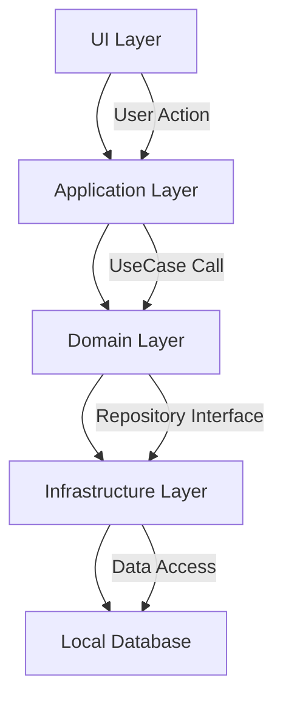

# 📝 シンプルメモアプリ

> **Flutter + クリーンアーキテクチャ**で構築されたメモ管理アプリケーション  
> **目的**: 日常的なメモの作成・管理を効率的に行う

## 📋 概要

このアプリケーションは、[flutter_init](https://github.com/utakata-haru/flutter_init.git)テンプレートを活用して開発されたシンプルなメモ管理アプリです。クリーンアーキテクチャに基づいた構造化されたプロジェクトセットアップと、現代的なFlutter開発のベストプラクティスを実装しています。

## ⭐ 主な機能

### 📝 メモ管理機能
- **メモ作成**: タイトルと本文を入力してメモを作成
- **メモ一覧**: 作成したメモを時系列で表示
- **メモ詳細**: メモの内容を詳細表示
- **メモ編集**: 既存メモの内容を編集・更新
- **メモ削除**: 不要なメモを削除
- **検索機能**: メモのタイトルや内容で検索

### 🎨 ユーザーインターフェース
- **直感的なUI**: Material Design 3に基づいたモダンなデザイン
- **レスポンシブ対応**: 様々な画面サイズに対応
- **リアルタイム更新**: データの変更が即座に反映
- **ローディング表示**: 非同期処理中の適切なフィードバック

## 🏗️ アーキテクチャ

### クリーンアーキテクチャ（4層構造）

```
lib/features/admin/memo/
├── 1_domain/           # ドメイン層（ビジネスロジック）
│   ├── 1_entities/     # エンティティ
│   ├── 2_repositories/ # リポジトリインターフェース
│   └── 3_usecases/     # ユースケース
├── 2_infrastructure/   # インフラ層（データアクセス）
│   ├── 1_models/       # データモデル
│   ├── 2_data_sources/ # データソース
│   └── 3_repositories/ # リポジトリ実装
├── 3_application/      # アプリケーション層（状態管理）
│   ├── 1_states/       # 状態定義
│   ├── 2_providers/    # 依存性注入
│   └── 3_notifiers/    # 状態管理ロジック
└── 4_presentation/     # プレゼンテーション層（UI）
    ├── 1_widgets/      # UIコンポーネント
    └── 2_pages/        # 画面
```

### 🔧 技術スタック

#### フレームワーク・ライブラリ
- **Flutter**: 3.x（クロスプラットフォーム開発）
- **Dart**: 3.x（プログラミング言語）

#### 状態管理
- **Riverpod**: 2.x（状態管理・依存性注入）
- **Flutter Hooks**: リアクティブなUI構築

#### データ永続化
- **Drift**: SQLiteベースのローカルデータベース
- **Path Provider**: ファイルパス管理

#### ナビゲーション
- **Go Router**: 宣言的ルーティング

#### 開発支援
- **Riverpod Generator**: コード生成による型安全性
- **Build Runner**: コード生成ツール

## 🚀 セットアップ

### 前提条件
- Flutter SDK 3.0.0 以上
- Dart SDK 3.0.0 以上

### インストール手順

1. **リポジトリのクローン**
```bash
git clone <repository-url>
cd memo_app
```

2. **依存関係のインストール**
```bash
flutter pub get
```

3. **コード生成の実行**
```bash
flutter packages pub run build_runner build
```

4. **アプリケーションの起動**
```bash
flutter run
```

## 📱 画面構成

### 1. メモ一覧画面（`MemoListPage`）
- アプリのホーム画面
- 作成したメモの一覧表示
- 検索機能
- 新規作成ボタン（FloatingActionButton）

### 2. メモ作成画面（`MemoCreatePage`）
- 新しいメモの作成
- タイトル・本文入力フィールド
- 保存・キャンセル機能

### 3. メモ詳細画面（`MemoDetailPage`）
- メモの詳細表示
- 編集モードへの切り替え
- 削除機能

## 🔄 データフロー



## 📂 主要ファイル

### Domain層
- `memo_entity.dart`: メモエンティティ
- `memo_repository.dart`: リポジトリインターフェース
- `create_memo_usecase.dart`: メモ作成ユースケース
- `get_all_memos_usecase.dart`: メモ一覧取得ユースケース
- `update_memo_usecase.dart`: メモ更新ユースケース
- `delete_memo_usecase.dart`: メモ削除ユースケース

### Infrastructure層
- `memo_model.dart`: データモデル
- `memo_local_data_source.dart`: ローカルデータソースインターフェース
- `memo_local_data_source_impl.dart`: ローカルデータソース実装
- `memo_repository_impl.dart`: リポジトリ実装

### Application層
- `memo_state.dart`: メモ状態定義
- `memo_providers.dart`: 依存性注入プロバイダー
- `memo_notifier.dart`: 単一メモ状態管理
- `memo_list_notifier.dart`: メモ一覧状態管理

### Presentation層
- `memo_list_page.dart`: メモ一覧画面
- `memo_create_page.dart`: メモ作成画面
- `memo_detail_page.dart`: メモ詳細画面
- `memo_list_view.dart`: メモ一覧ウィジェット

## 🧪 テスト

```bash
# 全テストの実行
flutter test

# カバレッジレポートの生成
flutter test --coverage
```

## 🔧 開発コマンド

### コード生成
```bash
# 一回限りの生成
flutter packages pub run build_runner build

# 監視モードでの生成
flutter packages pub run build_runner watch

# 既存ファイルを削除して再生成
flutter packages pub run build_runner build --delete-conflicting-outputs
```

### 静的解析
```bash
# コード解析
flutter analyze

# フォーマット
flutter format .
```

## 📋 開発ガイドライン

### アーキテクチャ原則
- **依存性の方向**: 外側から内側へ（Presentation → Application → Domain ← Infrastructure）
- **責務の分離**: 各層の役割を明確に分離
- **テスタビリティ**: 依存性注入によるテスト容易性の確保

### コーディング規約
- **命名規則**: Dartの標準的な命名規約に従う
- **コメント**: 日本語でのコメント記述
- **型安全性**: 厳密な型定義の使用

## 🤝 コントリビューション

1. フォークを作成
2. フィーチャーブランチを作成 (`git checkout -b feature/amazing-feature`)
3. 変更をコミット (`git commit -m 'Add some amazing feature'`)
4. ブランチにプッシュ (`git push origin feature/amazing-feature`)
5. プルリクエストを作成

## 📄 ライセンス

このプロジェクトはMITライセンスの下で公開されています。詳細は[LICENSE](LICENSE)ファイルを参照してください。

## 🙏 謝辞

- [flutter_init](https://github.com/utakata-haru/flutter_init.git) - プロジェクトテンプレートの提供
- Flutter Team - 素晴らしいフレームワークの開発
- Riverpod Team - 優れた状態管理ライブラリの提供

---

**開発者**: [Your Name]  
**最終更新**: 2024年1月